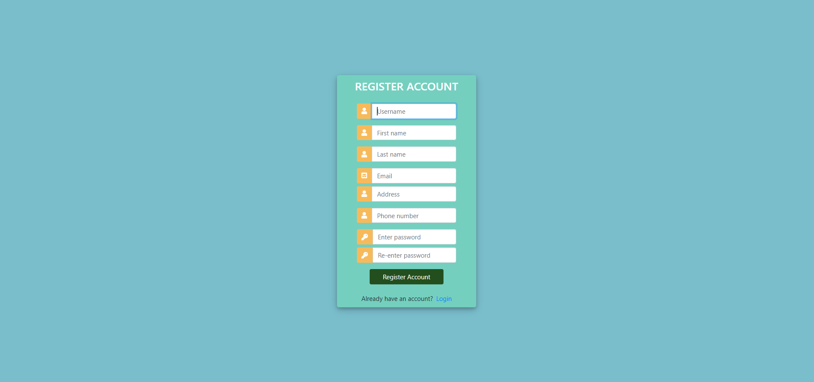
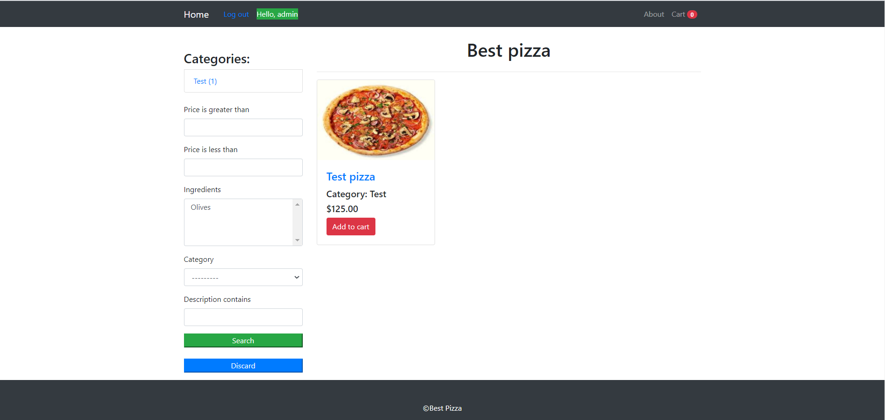
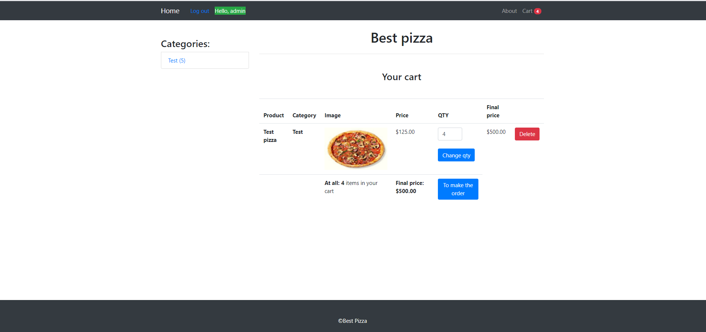
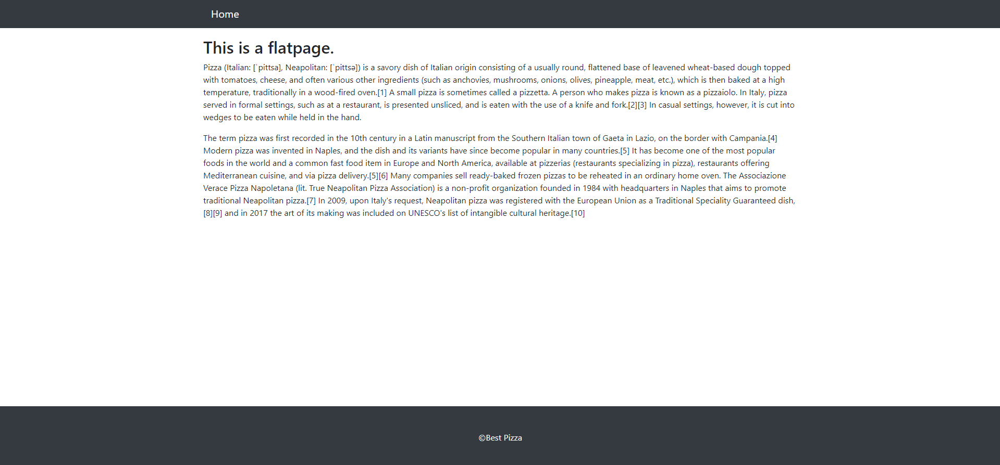
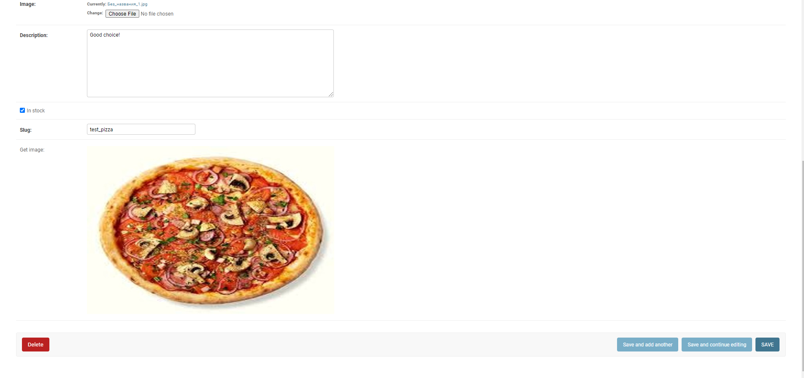

# Pizzeria Project
This is a pizzeria website where users can easily find pizzas they want, add them to a cart, change quantity of the products they chose, make orders,
but these actions are available only for authorized and authenticated users (when a user wants to view the site, he is being redirected to the registration page and then to the login page).
There are different categories with related pizzas, but if it is still so difficult for customers to find pizzas that satisfy their desires, they can use filtering made with [*django_filter*](https://django-filter.readthedocs.io/en/stable/guide/usage.html)
to look up for something they really want. The following images represent registration page, login page, the main page of the site, and the cart:
   
# Technologies used
* [**Django Framework**](https://www.djangoproject.com/)
* [**Django REST Framework**](https://www.django-rest-framework.org/)
* [**SQLite**](https://www.sqlite.org/index.html)
* [**Pillow**](https://pillow.readthedocs.io/en/stable/)
* [**django_filter**](https://django-filter.readthedocs.io/en/stable/guide/usage.html)
* [**django-crispy-forms**](https://django-crispy-forms.readthedocs.io/en/latest/)
* [**The flatpages app**](https://docs.djangoproject.com/en/3.1/ref/contrib/flatpages/)
# Features
* Using [*django_filter*](https://django-filter.readthedocs.io/en/stable/guide/usage.html) I overrode *ModelMultipleChoiceFilter* for ingredients in a pizza. Original filtering works through
'|' binary operator, but now pizzas are filtered through '&'. For example, if some pizzas contain salami and olives and
  a customer chooses 'salami' and 'olives' in filters, only pizzas with 'salami' **AND** 'olives' will be shown.
  The following code in [*filters.py*](pizzeria/filters.py) did it:
  ```Python
  class PizzaFilter(django_filters.FilterSet):
    ...
    ingredients = django_filters.ModelMultipleChoiceFilter(field_name='ingredients',
                                                           queryset=Ingredient.objects.all(),
                                                           method='filter_ingredients')
    ...
  
  @staticmethod
  def filter_ingredients(queryset, name, value):
      if name and value:
          pizzas_names = []
          ingredients_name = list(value)
          queryset = queryset.filter(ingredients__name__in=ingredients_name)
          for key, value in Counter(queryset).items():
              if value == len(ingredients_name):
                  pizzas_names.append(key)
          queryset = Pizza.objects.filter(name__in=pizzas_names, in_stock=True)
          return queryset
      else:
          return queryset
  ```
* Next feature does the following: when an image of some pizza or ingredient is being uploaded, and it's resolution is different from desired,
the following code resizes it to needed resolution (and raises an Exception if it's size is bigger than allowed).
  I wrote a function that does it and added methods in *Pizza* and *Ingredient* [models](pizzeria/models.py):
  ```Python
   # function
      def change_image_resolution(**kwargs):
        image = kwargs.get('image')
        min_resolution = kwargs.get('min_resolution')
        max_resolution = kwargs.get('max_resolution')
        max_image_size = kwargs.get('max_image_size')
        new_image_width = kwargs.get('new_image_width')
        new_image_height = kwargs.get('new_image_height')
    
        img = Image.open(image)
        min_height, min_width = min_resolution
        max_height, max_width = max_resolution
        if image.size > max_image_size:
            raise Exception(f'Uploaded images\'s size could not be bigger than {max_image_size}')
        if img.height < min_height or img.width < min_width or img.height > max_height or img.width > max_width:
            new_img = img.convert('RGB')
            resized_new_image = new_img.resize((new_image_width, new_image_height), Image.ANTIALIAS)
            file_stream = BytesIO()
            resized_new_image.save(file_stream, 'JPEG', quality=90)
            file_stream.seek(0)
            name = image.name
            image = InMemoryUploadedFile(
                file_stream, 'ImageField', name, 'jpeg/image', sys.getsizeof(file_stream), None
            )
        return image
  
  # method
      def get_image(self):
        image = get_image(self, self.new_image_width, self.new_image_height)
        return image
  ```
* **Django REST Framework**:
  * Wrote [*serializers*](pizzeria/api/serializers.py), [*api_views*](pizzeria/api/api_views.py), using [*viewsets*](https://www.django-rest-framework.org/api-guide/viewsets/) and [*generic views*](https://www.django-rest-framework.org/api-guide/generic-views/).
  * Implemented [token authentication](https://www.django-rest-framework.org/api-guide/authentication/#tokenauthentication),
    [PageNumberPagination](https://www.django-rest-framework.org/api-guide/pagination/#setup), 
    [SearchFilter](https://www.django-rest-framework.org/api-guide/filtering/#searchfilter),
    [OrderingFilter](https://www.django-rest-framework.org/api-guide/filtering/#orderingfilter).
  * Changed permissions for sending requests in [*api_views*](pizzeria/api/api_views.py) for pizzas, categories and orders, so a user has to be authenticated to send a **GET** request and be the admin user to send **POST**, **PUT** and **DELETE**.
    Only a user who made an order has permission to delete it, sending a **DELETE** request.
  * Overrode *create* method in [*api_views/PizzaViewSet*](pizzeria/api/api_views.py), so now it's possible to write a category name and ingredients names 
    instead of writing primary keys.
* Added data validation in [*forms.py*](pizzeria/forms.py) using [regular expression](https://docs.python.org/3/library/re.html).
   Validation includes the valid input of *first name*, *last name*, *phone*, *date/time* in *OrderForm*, and
    the valid input of *first name*, *last name*, *phone* and uniqueness of *email* in *CreateUserForm*.
* Added a flatpage *about* using [**The flatpages app**](https://docs.djangoproject.com/en/3.1/ref/contrib/flatpages/). The good thing about it is that the content of this page can be easily changed through the admin site. This is how it looks like:

* Customized the admin site: added inlines, filters, search fields. There is also an opportunity to see 
the current photo of an ingredient/pizza: 
# How to run
1. Go to command line and choose or make a directory, where you want this cloned project to be 
   (if you use Windows, you need to press Windows + R, type cmd, and hit Enter to open Command Prompt window, then type the path you want, I will place this project on my desktop):
   * *cd Desktop*
2. Now you need to make sure [**git**](https://git-scm.com/) is installed on your computer (type the following):
   * *git --version*
       * if your command prompt shows something like: *git version 2.29.2.windows.2*, go to the 3rd step.
       * otherwise, go [here](https://phoenixnap.com/kb/how-to-install-git-windows) and read how to install it properly.
3. So, it is time to clone the project:
   * *git clone https://github.com/Fagtoy/pizzeria_project.git*
     * Then you have to go in project directory, it's default name is *pizzeria_project*:
        * *cd pizzeria_project*
5. Now it is time to set up your virtual environment:
   * *pip install pipenv*
   * *pipenv shell* 
6. Final steps:
   * Install requirements: *pip install -r requirements.txt*
   * *python manage.py migrate*
   * *python manage.py runserver*
7. If you want to open the admin site you need a superuser, so type: *python manage.py createsuperuser* and 
   fill the fields command prompt will show you. Now there is a problem, when you try to open the site, you will get an error, let's fix it.
   Go to the admin site, open *Customers* and add a customer with your superuser (in the field "Customer" choose your superuser).
